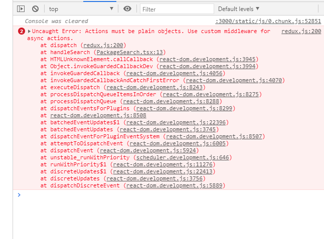

### Section 4: Redux

```ts
yarn add @types/react-redux axios react-redux redux redux-thunk
```

A function component to start with

```ts
import React, { useState } from "react";
import { Button } from "@material-ui/core";

const PackageSearch = () => {
  const [searchTerm, SetSearchTerm] = useState("");

  const handleChange = (evt: React.ChangeEvent<HTMLInputElement>) => {
    const val = evt.target.value;
    if (val && val.trim()) {
      SetSearchTerm(val.trim());
    }
  };
  return (
    <form>
      <input value={searchTerm} onChange={handleChange} />
      <Button variant="contained" color="primary" onClick={() => {}}>
        Search Package
      </Button>
    </form>
  );
};

export default PackageSearch;
```

#### Step 01: Create our first reducer

reducers/repositoryReducer.ts

```ts
export interface RepositoryReducerState {
  data: string[];
  error: string | null;
  isLoading: boolean;
}

const initState: RepositoryReducerState = {
  data: [],
  error: null,
  isLoading: false,
};

/* a reducer function must return a new state */
export const repositoryReducer = (
  state: RepositoryReducerState = initState,
  action: any
) => {
  switch (action.type) {
    default:
      return state;
  }
};
```

#### Step 02: export our reducer(s)

reducers/index.ts

```ts
export * from "./repositoryReducer";
```

#### Step 03: Create redux store object

store/configureStore.ts

```ts
import { createStore, combineReducers } from "redux";
import * as reducers from "../reducers/";

const combinedReducers = combineReducers(reducers);
// to create a Redux store object, then export
export const store = createStore(combinedReducers);
```

#### Step 04: Import store object from root element, then wrap root element

/index.ts

```ts
import React from "react";
import ReactDOM from "react-dom";
import PackageSearch from "./components/PackageSearch";
import { Provider } from "react-redux";
import { store } from "./store/configureStore";

ReactDOM.render(
  <Provider store={store}>
    <PackageSearch />
  </Provider>,
  document.querySelector("#root")
);
```

Note: from step 01 - 04 are setting up the redux store.

#### Step 05: Create our first ActionTypes Enum

actions/repository/actionTypes.ts

```ts
export enum ActionTypes {
  FETCH_REPOSITORY = "FETCH_REPOSITORY",
  FETCH_REPOSITORY_SUCCESS = "FETCH_REPOSITORY_SUCCESS",
  FETCH_REPOSITORY_FAIL = "FETCH_REPOSITORY_FAIL",
}
```

actions/repository/actionCreator.ts

#### Step 06: Create our first action creator (functions)

```ts
import { Dispatch } from "redux";
import { ActionTypes } from "./actionTypes";

export const fetchRepositoryAsync = (searchTerm: string) => {
  return (dispatch: Dispatch) => {
    dispatch({ type: ActionTypes.FETCH_REPOSITORY });
  };
};
```

#### Step 07: Add corresponding logic in repositoryReducer

reducers/repositoryReducer.ts

```ts
import { ActionTypes } from "../actions/repository/actionTypes";

export interface RepositoryReducerState {
  data: string[];
  error: string | null;
  isLoading: boolean;
}

const initState: RepositoryReducerState = {
  data: [],
  error: null,
  isLoading: false,
};

/* a reducer function must return a new state */
export const repositoryReducer = (
  state: RepositoryReducerState = initState,
  action: any
) => {
  switch (action.type) {
    case ActionTypes.FETCH_REPOSITORY:
      return {
        ...state,
        isLoading: true,
      };
    default:
      return state;
  }
};
```

#### Step 08: Hook up action creator in `PageSearch` component

```ts
import React, { useState } from "react";
import { useDispatch } from "react-redux";
import { Button } from "@material-ui/core";

import { fetchRepositoryAsync } from "../actions/repository/actionCreator";

const PackageSearch = () => {
  const [searchTerm, SetSearchTerm] = useState("");

  const dispatch = useDispatch();

  const handleSearch = () => {
    dispatch(fetchRepositoryAsync(searchTerm));
  };

  const handleChange = (evt: React.ChangeEvent<HTMLInputElement>) => {
    const val = evt.target.value;
    if (val && val.trim()) {
      SetSearchTerm(val.trim());
    }
  };
  return (
    <form>
      <input value={searchTerm} onChange={handleChange} />
      <Button variant="contained" color="primary" onClick={handleSearch}>
        Search Package
      </Button>
    </form>
  );
};

export default PackageSearch;
```

Now if you search anything, you will get an error like below:



This is because you haven't set up redux-thunk middleware yet.

#### Step 09: Set up redux-thunk middleware

store/configureStore.ts

```ts
import { createStore, combineReducers, applyMiddleware } from "redux";
import ReduxThunk from "redux-thunk";
import * as reducers from "../reducers/";

const combinedReducers = combineReducers(reducers);
// to create a Redux store object, then export
export const store = createStore(combinedReducers, applyMiddleware(ReduxThunk));
```

Now the redux is working!!!!

#### Step 09: Map state (a slice of store object) to component

by using `useSelector` from `react-redux`. Similar with `mapStateToProps` from previous version, it returns a slice of the state object

```ts
const { data, error, isLoading }: RepositoryReducerState = useSelector(
  (state: RootState) => state.repositoryReducer
);
```

```ts
import React, { useState } from "react";
import { useDispatch, useSelector } from "react-redux";
import { Button, CircularProgress } from "@material-ui/core";
import Alert from "@material-ui/lab/Alert";

import { fetchRepositoryAsync } from "../actions/repository/actionCreator";
import { RootState } from "../store/configureStore";
import { RepositoryReducerState } from "../reducers";

const PackageSearch = () => {
  const [searchTerm, SetSearchTerm] = useState("");

  const dispatch = useDispatch();

  const { data, error, isLoading }: RepositoryReducerState = useSelector(
    (state: RootState) => state.repositoryReducer
  );

  const handleSearch = () => {
    dispatch(fetchRepositoryAsync(searchTerm));
  };

  const handleChange = (evt: React.ChangeEvent<HTMLInputElement>) => {
    const val = evt.target.value;
    if (val && val.trim()) {
      SetSearchTerm(val.trim());
    }
  };
  return (
    <form>
      <input value={searchTerm} onChange={handleChange} />
      <Button variant="contained" color="primary" onClick={handleSearch}>
        Search Package
      </Button>
      {isLoading && (
        <div>
          <CircularProgress color="secondary" />
        </div>
      )}
      {error && <Alert severity="error">error</Alert>}
    </form>
  );
};

export default PackageSearch;
```

And the `RootState` type is defined in `store/configStore` file

```ts
import { createStore, combineReducers, applyMiddleware } from "redux";
import ReduxThunk from "redux-thunk";
import * as reducers from "../reducers/";

const combinedReducers = combineReducers(reducers);

export type RootState = ReturnType<typeof combinedReducers>;

// to create a Redux store object, then export
export const store = createStore(combinedReducers, applyMiddleware(ReduxThunk));
```

#### Step 10. Add async action creators to fetch data

actions/repository/actionCreators.ts

```ts
import { Dispatch } from "redux";
import instance from "../../utils/axios";
import { ActionTypes } from "./actionTypes";

export const fetchRepositoryAsync = (searchTerm: string) => {
  return async (dispatch: Dispatch) => {
    // settings `isLoading` to true
    dispatch({ type: ActionTypes.FETCH_REPOSITORY });
    try {
      const res = await instance.get(`search`, {
        params: {
          text: searchTerm,
        },
      });
      if (res.data.objects) {
        const names = res.data.objects.map(
          (object: any) => object.package.name
        );
        dispatch({
          type: ActionTypes.FETCH_REPOSITORY_SUCCESS,
          payload: names,
        });
      }
    } catch (err) {
      dispatch({
        type: ActionTypes.FETCH_REPOSITORY_FAIL,
        payload: err.message,
      });
    }
  };
};
```

fix the repositoryReducer

```ts
import { ActionTypes } from "../actions/repository/actionTypes";

export interface RepositoryReducerState {
  data: string[];
  error: string | null;
  isLoading: boolean;
}

const initState: RepositoryReducerState = {
  data: [],
  error: null,
  isLoading: false,
};

/* a reducer function must return a new state */
export const repositoryReducer = (
  state: RepositoryReducerState = initState,
  action: any
) => {
  switch (action.type) {
    case ActionTypes.FETCH_REPOSITORY:
      return {
        ...state,
        isLoading: true,
      };
    case ActionTypes.FETCH_REPOSITORY_SUCCESS:
      return {
        ...state,
        data: action.payload,
        isLoading: false,
      };
    case ActionTypes.FETCH_REPOSITORY_FAIL:
      return {
        ...state,
        error: action.payload,
        isLoading: false,
      };
    default:
      return state;
  }
};
```

And add logic in `PackageSearch` component to display data/error

```ts
import React, { useState } from "react";
import { useDispatch, useSelector } from "react-redux";
import { Button, CircularProgress } from "@material-ui/core";
import Alert from "@material-ui/lab/Alert";

import { fetchRepositoryAsync } from "../actions/repository/actionCreator";
import { RootState } from "../store/configureStore";
import { RepositoryReducerState } from "../reducers";

const PackageSearch = () => {
  const [searchTerm, SetSearchTerm] = useState("");

  const dispatch = useDispatch();

  const { data, error, isLoading }: RepositoryReducerState = useSelector(
    (state: RootState) => state.repositoryReducer
  );

  const handleSearch = () => {
    dispatch(fetchRepositoryAsync(searchTerm));
  };

  const handleChange = (evt: React.ChangeEvent<HTMLInputElement>) => {
    const val = evt.target.value;
    if (val && val.trim()) {
      SetSearchTerm(val.trim());
    }
  };
  return (
    <form>
      <input value={searchTerm} onChange={handleChange} />
      <Button variant="contained" color="primary" onClick={handleSearch}>
        Search Package
      </Button>
      {isLoading && (
        <div>
          <CircularProgress color="secondary" />
        </div>
      )}
      {error && <Alert severity="error">error</Alert>}
      {!!data.length && data.map((item) => <li key={item}>{item}</li>)}
    </form>
  );
};

export default PackageSearch;
```

#### Step 11: fix the 'any' type is action object

need to define a type like below.

Note: `type` field must match case `switch-case` statement

```ts
export interface FetchRepository {
  type: ActionTypes.FETCH_REPOSITORY;
}

export interface FetchRepositorySuccess {
  type: ActionTypes.FETCH_REPOSITORY_SUCCESS;
  data: string[];
}

export interface FetchRepositoryFail {
  type: ActionTypes.FETCH_REPOSITORY_FAIL;
  error: string | null;
}

export type RepositoryAction =
  | FetchRepository
  | FetchRepositorySuccess
  | FetchRepositoryFail;
```

and `switch`:

```ts
export const repositoryReducer = (
  state: RepositoryReducerState = initState,
  action: RepositoryAction
) => {
  switch (action.type) {
    case ActionTypes.FETCH_REPOSITORY:
      return {
        ...state,
        isLoading: true,
      };
    case ActionTypes.FETCH_REPOSITORY_SUCCESS:
      return {
        ...state,
        data: action.data,
        isLoading: false,
      };
    case ActionTypes.FETCH_REPOSITORY_FAIL:
      return {
        ...state,
        error: action.error,
        isLoading: false,
      };
    default:
      return state;
  }
};
```

meanwhile, update your actionCreator to dispatch action object with proper key name

```ts
import { Dispatch } from "redux";
import { RepositoryAction } from "../../reducers/repositoryReducer";
import instance from "../../utils/axios";
import { ActionTypes } from "./actionTypes";

export const fetchRepositoryAsync = (searchTerm: string) => {
  return async (dispatch: Dispatch<RepositoryAction>) => {
    // settings `isLoading` to true
    dispatch({ type: ActionTypes.FETCH_REPOSITORY });
    try {
      const res = await instance.get(`search`, {
        params: {
          text: searchTerm,
        },
      });
      if (res.data.objects) {
        const names = res.data.objects.map(
          (object: any) => object.package.name
        );
        dispatch({
          type: ActionTypes.FETCH_REPOSITORY_SUCCESS,
          data: names,
        });
      }
    } catch (err) {
      dispatch({
        type: ActionTypes.FETCH_REPOSITORY_FAIL,
        error: err.message,
      });
    }
  };
};
```
